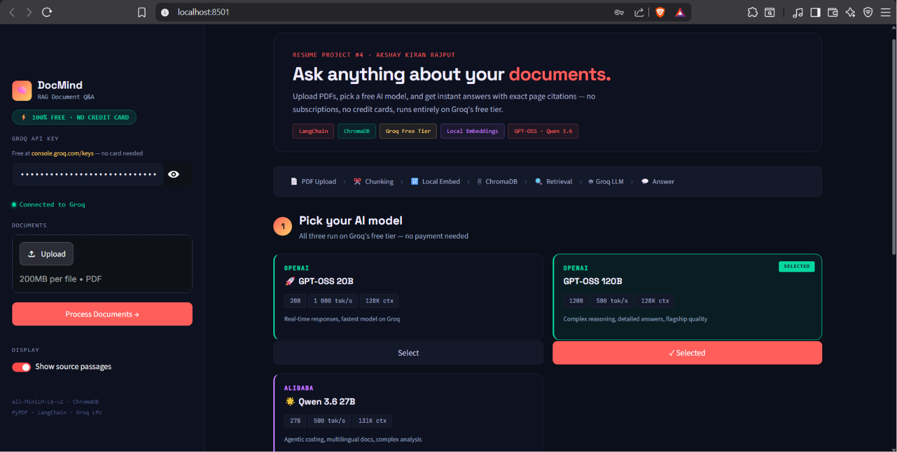
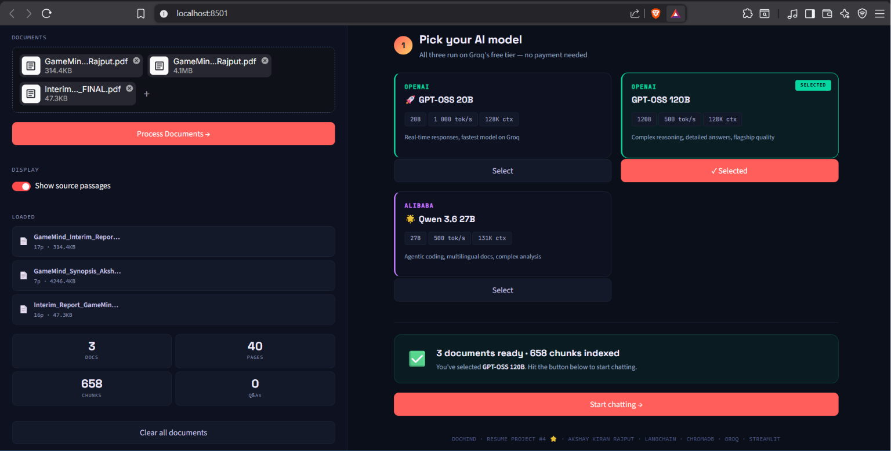
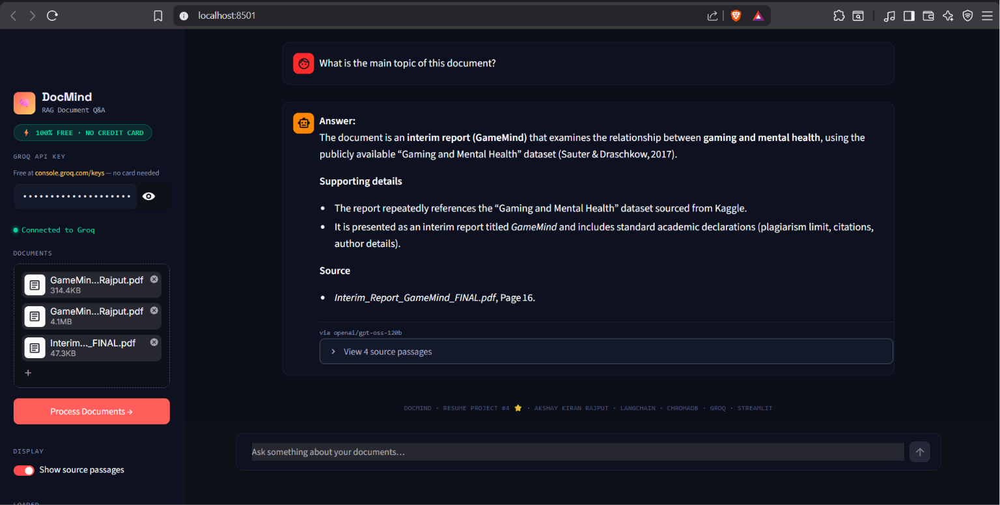
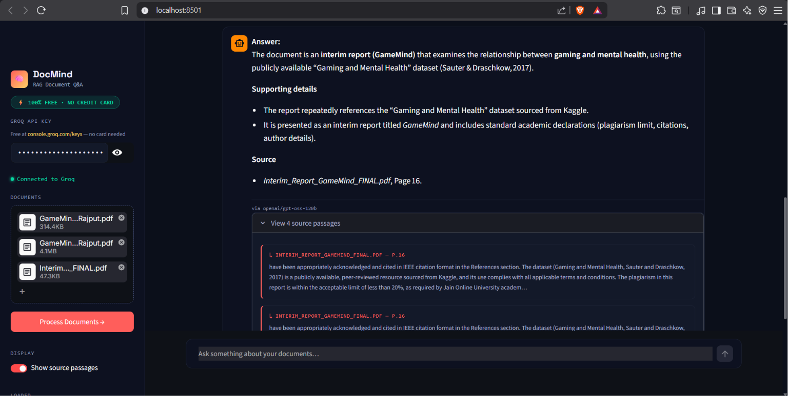
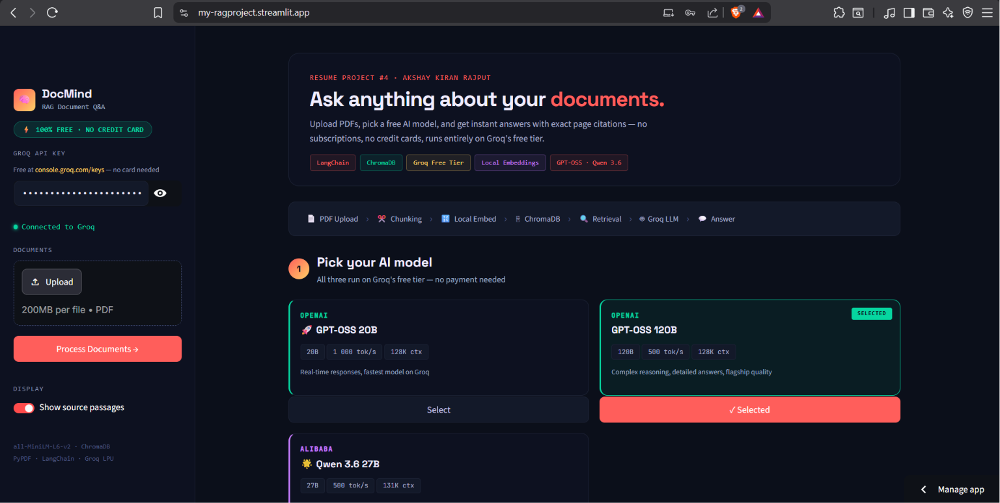

<div align="center">

# 🧠 DocMind — RAG Document Q&A System

**Resume Project #4 ⭐ STAR PROJECT · Akshay Kiran Rajput · GenAI Developer Portfolio**

> Turn any PDF into a queryable knowledge base in seconds.
> Upload → Ask in plain English → Get cited answers with exact page numbers.

[](https://python.org)
[](https://streamlit.io)
[](https://langchain.com)
[](https://groq.com)
[](https://www.trychroma.com)
[](https://huggingface.co)
[](https://my-ragproject.streamlit.app/)
[](LICENSE)

### 🚀 [Live Demo → my-ragproject.streamlit.app](https://my-ragproject.streamlit.app/)

**Multi-PDF · Persistent Vector Store · 3 Free LLMs · Streamed Answers · Zero Embedding Cost**

</div>

---

## 📋 Table of Contents

- [📸 Screenshots](#-application-screenshots)
- [🧠 What It Does](#-what-it-does)
- [💡 Why DocMind Stands Out](#-why-docmind-stands-out)
- [✨ Features](#-features)
- [🏗 Architecture](#-architecture)
- [📁 Project Structure](#-project-structure)
- [⚡ Run Locally](#-run-locally)
- [🌐 Deploy on Streamlit Cloud](#-deploy-free-on-streamlit-cloud)
- [🤖 Available Models](#-available-models-all-free-on-groq)
- [🛠 Tech Stack](#-tech-stack)
- [✍️ Resume Bullets](#️-resume-bullets)
- [💬 Interview Talking Points](#-interview-talking-points)
- [🔮 Future Improvements](#-future-improvements)
- [👤 Author](#-author)

---

## 📸 Application Screenshots

### 🏠 Home — Hero Banner, Pipeline Flow & Model Selector

<p align="center">
  
</p>

The home screen shows the **"Ask anything about your documents"** hero banner, a live RAG pipeline breadcrumb (PDF Upload → Chunking → Local Embed → ChromaDB → Retrieval → Groq LLM → Answer), and the 3-model card selector. GPT-OSS 120B is pre-selected. The sidebar shows the Groq API key connected with a green dot indicator and the **⚡ 100% FREE · NO CREDIT CARD** badge.

---

### ⚡ Documents Indexed & Ready to Chat

<p align="center">
  
</p>

After uploading and processing, the sidebar shows 3 documents loaded (GameMind Synopsis, Interim Reports) with file sizes. The session stats grid shows **3 DOCS · 40 PAGES · 658 CHUNKS · 0 Q&As**. The main panel confirms **"3 documents ready · 658 chunks indexed"** with the **Start chatting →** button ready.

---

### 💬 Chat — Streamed Answer with Page Citation

<p align="center">
  
</p>

The user asks *"What is the main topic of this document?"* — DocMind streams back a structured answer identifying the GameMind interim report, with **Supporting details** and a **Source** section citing `Interim_Report_GameMind_FINAL.pdf, Page 16`. The model used (`via openai/gpt-oss-120b`) is shown at the bottom of every response.

---

### 🔍 Source Passage Viewer — Raw Retrieved Chunks

<p align="center">
  
</p>

Clicking **"View 4 source passages"** expands the retrieval layer — showing the exact text chunks retrieved from ChromaDB, each labeled with the source file and page number in red (`↳ INTERIM_REPORT_GAMEMIND_FINAL.PDF — P.16`). Full transparency: you see exactly what the LLM used to generate the answer.

---

### ☁️ Live on Streamlit Cloud

<p align="center">
  
</p>

DocMind runs live at **[my-ragproject.streamlit.app](https://my-ragproject.streamlit.app/)** — accessible from any browser worldwide, no local setup required. The **Manage app** button (bottom right) confirms Streamlit Cloud deployment.

---

## 🧠 What It Does

Most LLMs hallucinate when asked about private documents — they either make things up or admit they don't know. **DocMind solves this with RAG.**

Upload a research paper, textbook, contract, or report — DocMind semantically indexes every page into a persistent vector database and retrieves the most relevant chunks before generating an answer. The result is an AI that **only speaks from your document**, cites every claim with a page number, and lets you verify the source with one click.

**Built to demonstrate:**
- A complete **production RAG pipeline** — ingestion, chunking, embedding, retrieval, generation
- **Cost-conscious engineering** — local CPU embeddings eliminate the most expensive API call in a typical RAG stack
- **Multi-model LLM integration** — 3 switchable providers without touching the retrieval layer
- **Clean separation of concerns** — `rag_engine.py` handles all ML; `app.py` handles all UI; `config.py` handles all settings

---

## 💡 Why DocMind Stands Out

Most tutorial RAG demos use paid embedding APIs and in-memory vector stores that vanish on restart. DocMind makes deliberate engineering choices at every layer:

| | **DocMind** | **Typical RAG Demo** |
|---|---|---|
| **Embeddings** | `all-MiniLM-L6-v2` — local CPU, zero cost, no quota | OpenAI / Gemini API — paid per token |
| **LLM** | Groq free tier — 1,000 req/day, ~500 tok/s | OpenAI GPT-4 — $0.01+ per 1K tokens |
| **Vector DB** | ChromaDB — persists on disk across restarts | FAISS in-memory — lost on every restart |
| **Models available** | 3 switchable LLMs mid-session | Single hardcoded model |
| **Privacy** | Documents never leave your machine (embeddings are local) | Document text sent to embedding API |
| **Total cost** | **$0.00** | $$ per session |

---

## ✨ Features

| Feature | Details |
|---|---|
| 📄 **Multi-PDF Support** | Upload multiple PDFs and query across all of them in one question |
| 🗄️ **Persistent ChromaDB** | Vector store survives session restarts — no re-uploading ever |
| 📌 **Cited Answers** | Every response shows exact source file + page number |
| ⚡ **Streaming Responses** | Token-by-token output via Groq LPU — near-instant feel |
| 🤖 **3-Model Selector** | Switch GPT-OSS 20B · 120B · Qwen 3.6 27B mid-session without re-upload |
| 🔍 **Source Passage Viewer** | Collapsible expander shows exact retrieved chunks per answer |
| 🆓 **Zero Embedding Cost** | `sentence-transformers` runs 100% locally — no API, no quota, no billing |
| 💡 **Quick Questions** | One-click example prompts to get started instantly |
| 📊 **Live Session Stats** | Real-time counters — docs, pages, chunks indexed, Q&As answered |
| 🎨 **Dark Theme UI** | Custom CSS dark theme — Space Grotesk + JetBrains Mono fonts |
| 🔗 **RAG Pipeline Banner** | Visual breadcrumb showing every step: Upload→Chunk→Embed→Store→Retrieve→Answer |

---

## 🏗 Architecture

```
┌──────────────────────────────────────────────────────────────┐
│                     Streamlit Frontend  (app.py)              │
│       Sidebar · Model Cards · Chat History · Source View      │
└──────────────────────┬───────────────────────────────────────┘
                       │  uploaded PDF bytes
                       ▼
┌──────────────────────────────────────────────────────────────┐
│            Document Ingestion Pipeline  (rag_engine.py)       │
│                                                              │
│  PyPDFLoader                                                 │
│    └→ writes to tempfile → extracts pages                    │
│    └→ stamps source_file + page metadata on every doc        │
│                       │                                      │
│  RecursiveCharacterTextSplitter                              │
│    └→ chunk_size=1000 · overlap=200 · chunk_id metadata      │
│    └→ separators: ["\n\n", "\n", ". ", " ", ""]              │
│                       │                                      │
│  HuggingFaceEmbeddings  (all-MiniLM-L6-v2)                  │
│    └→ singleton — loaded once, reused across all PDFs        │
│    └→ CPU-only · 384-dim vectors · normalize_embeddings=True │
│                       │                                      │
│  Chroma.from_documents()                                     │
│    └→ persist_directory=./chroma_db · collection="rag_docs"  │
│    └→ cosine similarity · survives process restarts          │
└──────────────────────┬───────────────────────────────────────┘
                       │  user question (string)
                       ▼
┌──────────────────────────────────────────────────────────────┐
│            Retrieval & Generation  (LangChain LCEL chain)     │
│                                                              │
│  vectorstore.as_retriever(search_type="similarity", k=4)     │
│    └→ embeds question → top-4 cosine-matched chunks          │
│                       │                                      │
│  format_docs()  →  "--- Source: file.pdf | Page 3 ---\n..."  │
│                       │                                      │
│  PromptTemplate  →  RAG_SYSTEM_PROMPT                        │
│    └→ slots: {context} + {question}                          │
│                                                              │
│  LangChain LCEL chain:                                       │
│    {"context": retriever | format_docs,                      │
│     "question": RunnablePassthrough()}                       │
│    | prompt | ChatGroq(streaming=True) | StrOutputParser()   │
│                       │                                      │
│  chain.stream(question)  →  yields text chunks               │
└──────────────────────┬───────────────────────────────────────┘
                       │  streamed tokens + source Documents
                       ▼
┌──────────────────────────────────────────────────────────────┐
│    st.empty() accumulates chunks → live markdown render       │
│    st.expander() → source passages with file + page labels   │
└──────────────────────────────────────────────────────────────┘
```

---

## 📁 Project Structure

```
rag_qa_app/
│
├── app.py              ← Streamlit UI: sidebar, model cards, chat, streaming, source viewer
├── rag_engine.py       ← RAG pipeline: load → chunk → embed → store → retrieve → stream
├── config.py           ← Model registry, RAG system prompt, chunk params, example questions
│
├── screenshots/        ← App screenshots used in this README
│   ├── home.png
│   ├── indexed.png
│   ├── chat.png
│   ├── sources.png
│   └── deploy.png
│
├── requirements.txt    ← All dependencies
├── .env.example        ← API key template (copy to .env — never commit .env!)
├── .gitignore          ← Excludes .env · chroma_db/ · __pycache__/
└── README.md
```

---

## ⚡ Run Locally

### 1. Clone the repo

```bash
git clone https://github.com/Akshay291/rag_qa_app.git
cd rag_qa_app
```

### 2. Install dependencies

```bash
pip install -r requirements.txt
```

> 💡 First run downloads `all-MiniLM-L6-v2` (~90 MB) and caches it automatically. Every run after that is instant.

### 3. Get a free Groq API key

Go to **[console.groq.com/keys](https://console.groq.com/keys)** → Sign up → Create API Key
No credit card needed · Free tier: **1,000 requests/day**

### 4. Set up your `.env` file

**Windows:**
```cmd
copy .env.example .env
```

**Mac / Linux:**
```bash
cp .env.example .env
```

Open `.env` and paste your key:
```env
GROQ_API_KEY=gsk_your_key_here
```

> ⚠️ Never commit `.env` — it's already in `.gitignore`

### 5. Launch the app

```bash
streamlit run app.py
```

Open **[http://localhost:8501](http://localhost:8501)** in your browser.

**Workflow:** Select a model → Enter API key in sidebar → Upload PDFs → Process Documents → Start chatting!

---

## 🌐 Deploy Free on Streamlit Cloud

1. Push this repo to GitHub
2. Go to **[share.streamlit.io](https://share.streamlit.io)** → Sign in with GitHub
3. Click **New app** → Select your repo → Set main file path to `app.py`
4. Click **Advanced settings** → **Secrets** → paste:
   ```toml
   GROQ_API_KEY = "gsk_your_key_here"
   ```
5. Click **Deploy** — Streamlit auto-installs from `requirements.txt`, live in ~2 minutes

✅ **Already deployed at → [my-ragproject.streamlit.app](https://my-ragproject.streamlit.app/)**

---

## 🤖 Available Models (all free on Groq)

| Model | Params | Speed | Context | Free Requests | Best For |
|---|---|---|---|---|---|
| **GPT-OSS 20B** | 20B | 1,000 tok/s | 128K | 1,000/day | Real-time Q&A, fastest responses |
| **GPT-OSS 120B** | 120B | 500 tok/s | 128K | 1,000/day | Complex reasoning, detailed answers |
| **Qwen 3.6 27B** | 27B | 500 tok/s | 131K | 1,000/day | Multilingual docs, technical content |

Switch models mid-session from the sidebar card selector — ChromaDB collection is reused, no re-uploading required.

---

## 🛠 Tech Stack

| Layer | Technology |
|---|---|
| **Frontend** | Streamlit 1.28+ · Custom CSS dark theme · Space Grotesk + JetBrains Mono |
| **LLM** | Groq API — GPT-OSS 20B / 120B · Qwen 3.6 27B · `streaming=True` |
| **Embeddings** | HuggingFace `sentence-transformers` · `all-MiniLM-L6-v2` · local CPU · 384-dim |
| **Vector Database** | ChromaDB · persistent on disk · cosine similarity search |
| **RAG Orchestration** | LangChain LCEL · `ChatGroq` · `PromptTemplate` · `RunnablePassthrough` · `StrOutputParser` |
| **PDF Parsing** | `PyPDFLoader` (`langchain-community`) · `pypdf` backend |
| **Config & Secrets** | `python-dotenv` · centralized `config.py` · runtime sidebar key entry |

---

## ✍️ Resume Bullets

```
• Built DocMind, a production RAG system using LangChain + ChromaDB + Groq API;
  users upload PDFs and receive semantically-retrieved, page-cited answers streamed
  token-by-token via a dark-themed Streamlit UI — deployed live on Streamlit Cloud

• Engineered end-to-end RAG pipeline: PDF extraction (PyPDFLoader) → recursive
  chunking (1,000 chars / 200 overlap) → local HuggingFace embeddings
  (all-MiniLM-L6-v2, zero API cost, CPU-only, 384-dim) → persistent ChromaDB
  vector store → Top-4 cosine similarity retrieval → cited answer generation

• Implemented 3-model selector (GPT-OSS 20B, 120B, Qwen 3.6 27B) switchable
  mid-session via LangChain LCEL chain rebuild; multi-PDF querying across a shared
  ChromaDB collection; expandable source chunk viewer with file + page per answer
```

---

## 💬 Interview Talking Points

**Q: What is RAG and why did you build it instead of just prompting an LLM?**
> RAG — Retrieval-Augmented Generation — injects relevant context from the user's own documents into the LLM prompt at query time, instead of relying on training data. A plain LLM cannot answer questions about your private PDF — it either hallucinates or says it doesn't know. RAG solves this: we retrieve the most relevant passages first, then ask the LLM to answer only from those passages. Every answer is grounded and traceable to a specific page.

**Q: Why use local embeddings instead of an embedding API?**
> Three reasons — cost, speed, and privacy. `all-MiniLM-L6-v2` runs on CPU with no API key, no quota, no billing. It embeds a chunk in milliseconds with no network round-trip. And document content never leaves the machine during the embedding step. The quality tradeoff vs OpenAI or Gemini embeddings is negligible for document Q&A — the model is only 90MB, downloads once, and is cached.

**Q: How does ChromaDB store and search embeddings?**
> Each text chunk is converted into a 384-dimensional float vector. ChromaDB stores these vectors on disk in `./chroma_db`. At query time, the question is embedded with the same model and ChromaDB computes cosine similarity between the question vector and all stored chunk vectors — returning the top-4 closest matches. Cosine similarity measures the angle between vectors, so semantically similar text scores high even without exact word overlap.

**Q: What is chunking and why does the overlap matter?**
> Large documents must be split into smaller pieces to fit in the LLM's context window. `RecursiveCharacterTextSplitter` splits at natural boundaries — paragraphs, lines, sentences — with a 200-character overlap between adjacent chunks. This ensures a sentence spanning two chunks appears fully in at least one of them, preventing key information from being lost at the split point.

**Q: How does streaming work — what's the difference between `chain.stream()` and `chain.invoke()`?**
> `chain.invoke()` runs the full chain and returns the complete answer at once — the user stares at a blank screen until generation finishes. `chain.stream()` returns a generator that yields text chunks as they're produced by the LLM. In Streamlit, we accumulate these chunks into a string and call `st.empty().markdown()` on every chunk — so the user sees the answer building character by character in real time, which feels dramatically faster even though total generation time is identical.

**Q: How does the multi-model selector work without re-uploading documents?**
> The ChromaDB vector store and LangChain retriever are built once during PDF processing and stored in `st.session_state`. Switching models only rebuilds the LangChain LCEL chain with a new `ChatGroq(model=model_id)` instance — the ChromaDB collection is completely reused. This is a clean separation of concerns: the retrieval layer (embedding model + vector store) is independent of the generation layer (LLM choice).

**Q: How does multi-PDF querying work — can it cite from two PDFs in one answer?**
> Yes. Each document is loaded, chunked, and added to the same ChromaDB collection. Every chunk carries `source_file` and `page` metadata. The Top-4 similarity search spans the entire collection regardless of which PDF a chunk came from — a single answer can retrieve and cite chunks from three different documents simultaneously. The `format_docs()` function labels each chunk with its source file and page before injecting into the RAG prompt.

---

## 🔮 Future Improvements

| Improvement | Why It Matters |
|---|---|
| **Re-ranking retrieved chunks** | A cross-encoder re-ranker after Top-K retrieval improves answer quality on ambiguous queries |
| **PDF table & image extraction** | Current pipeline is text-only; tables and figures in PDFs are silently skipped |
| **Hybrid search (BM25 + semantic)** | Combining keyword and vector search improves recall on exact-match queries like names or codes |
| **Chat memory across sessions** | Current memory is session-only; persisting Q&A history enables long-running research workflows |
| **Upload progress bar** | Large PDFs take 10–20s to chunk and embed; a progress indicator improves UX significantly |
| **Export answers to PDF/DOCX** | Let users save their cited Q&A session as a downloadable research report |

---

## 👤 Author

**Akshay Kiran Rajput**
MCA Student · Jain Online University · Surat, Gujarat, India

[](https://www.linkedin.com/in/akshay-rajput-0925b8264)
[](https://github.com/Akshay291)
[](mailto:akshayrajput2914@gmail.com)
[](https://my-ragproject.streamlit.app/)

---

<div align="center">

If this project helped you, consider giving it a ⭐ — it helps others find it!

<sub>DocMind · Resume Project #4 ⭐ STAR PROJECT · LangChain · ChromaDB · Groq · HuggingFace · Streamlit</sub>

</div>
